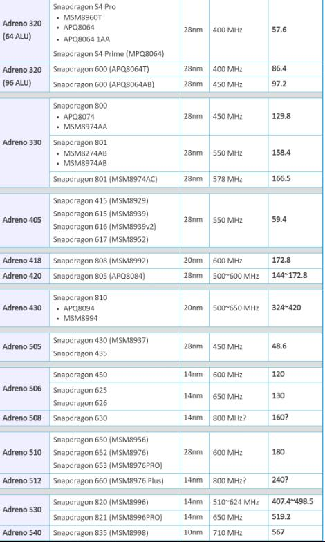

Wechat ID: NeuroMem

# Embedded-AI-Report

关注模型压缩、低比特量化、移动端推理加速优化、部署

- [2019-07-30](./embedded-ai-report/2019-07-30.md)  
- [2019-07-15](./embedded-ai-report/2019-07-15.md)  
- [2019-06-29](./embedded-ai-report/2019-06-29.md)  
- [2019-06-17](./embedded-ai-report/2019-06-17.md)  
- [2019-05-30](./embedded-ai-report/2019-05-30.md)  
- [2019-05-15](./embedded-ai-report/2019-05-15.md)  
- [2019-04-27](./embedded-ai-report/2019-04-27.md)  
- [2019-04-13](./embedded-ai-report/2019-04-13.md)  
- [2019-03-31](./embedded-ai-report/2019-03-31.md)  

# Awesome-Emebedded-AI

  <a href="https://github.com/ysh329/Embedded-AI-awesome">
    
  </a>

  A curated list of awesome <a href="#">A.I.</a> & <a href="#">Embedded/Mobile-devices</a> resources, tools and more.

  
  
  

<i>Looking for contributors. Submit a pull request if you have something to add :) </i>   
Please check the <a href="https://github.com/ysh329/Embedded-AI-awesome/blob/master/contributing.md">contribution guidelines</a> for info on formatting and writing pull requests.

## Contents

- [Device Benchmark](#devicebenchmark)
- [Papers](#papers)  
  - [Classic](#classic)
  - [Overview](#overview)
  - [Representation](#representation)
  - [Structure/Pattern](#structure)
  - [Binarization](#binarization)
  - [Pruning](#pruning)
  - [Quantization](#quantization)
  - [Low Rank Approximation](#lowrankapproximation)
  - [Distillation](#distillation)
  - [Execution/Frameworks](#frameworkpaper)
- [App-Experience](#experience)  
- [Demo-Codes](#codes)
  - [Android](#android)
  - [iOS](#ios)
  - [Vulkan](#vulkan)
- [Frameworks](#frameworks)
  - [general](#general)
  - [inference](#inference)
  - [benchmark](#benchmark)
- [Course/Guide/Tutorial](#course)
- [Hardware](#hardware)
  - [GPU](#gpu)
- [Company](#company)
- [News](#news)

# Device Benchmark

- [高通骁龙处理器排行榜,强大性能一览无余 | Qualcomm](https://www.qualcomm.cn/snapdragon/processors/comparison)
- [手机CPU性能天梯图 CPU performance of mobile comparison | mydriver](http://www.mydrivers.com/zhuanti/tianti/01/)
- Qualcomm Adreno GPU Performance as below:

# Papers

## Classic

* [1512.03385] [Deep Residual Learning for Image Recognition](https://arxiv.org/abs/1512.03385)
* [1610.02357] [Xception: Deep Learning with Depthwise Separable Convolutions](https://arxiv.org/abs/1610.02357)
* [1611.05431] **ResNeXt**: [Aggregated Residual Transformations for Deep Neural Networks](https://arxiv.org/abs/1611.05431)

## Overview

* [1703.09039] [Efficient Processing of Deep Neural Networks: A Tutorial and Survey](https://arxiv.org/abs/1703.09039)  
* [1707.01209] [Model compression as constrained optimization, with application to neural nets. Part I: general framework](https://arxiv.org/abs/1707.01209)
* [1707.04319] [Model compression as constrained optimization, with application to neural nets. Part II: quantization](https://arxiv.org/abs/1707.04319)

## Representation

- [1707.09926] [A Framework for Super-Resolution of Scalable Video via Sparse Reconstruction of Residual Frames](https://arxiv.org/abs/1707.09926v1)  
- [1608.01409] [Faster CNNs with Direct Sparse Convolutions and Guided Pruning](https://arxiv.org/abs/1608.01409v5)  
* [SenSys ’16] [Sparsification and Separation of Deep Learning Layers for Constrained Resource Inference on Wearables](http://niclane.org/pubs/sparsesep_sensys.pdf)
* [IoT-App ’15] [An Early Resource Characterization of Deep Learning on Wearables, Smartphones and Internet-of-Things Devices](http://niclane.org/pubs/iotapp15_early.pdf)

## Structure

- [1704.06904] [Residual Attention Network for Image Classification](https://arxiv.org/pdf/1704.06904.pdf) [[code]](https://github.com/buptwangfei/residual-attention-network)  
- [BranchyNet: Fast Inference via Early Exiting from Deep Neural Networks](http://www.eecs.harvard.edu/~htk/publication/2016-icpr-teerapittayanon-mcdanel-kung.pdf)  
* [CVPR2017] [Squeeze-and-Excitation networks (ILSVRC 2017 winner) at CVPR2017](http://image-net.org/challenges/talks_2017/SENet.pdf)  
* [1707.06342] [ThiNet: A Filter Level Pruning Method for Deep Neural Network Compression](https://arxiv.org/abs/1707.06342)
* [1707.01083] [ShuffleNet: An Extremely Efficient Convolutional Neural Network for Mobile Devices](https://arxiv.org/abs/1707.01083)
* [1704.04861] [MobileNets: Efficient Convolutional Neural Networks for Mobile Vision Applications](https://arxiv.org/abs/1704.04861)
- [1707.06990] [Memory-Efficient Implementation of DenseNets](https://arxiv.org/abs/1707.06990)  
* [1706.03912] [SEP-Nets: Small and Effective Pattern Networks](https://arxiv.org/abs/1706.03912)

## Binarization

- [CVPR2017] [Local Binary Convolutional Neural Networks](http://xujuefei.com/lbcnn.html) [[code]](https://github.com/juefeix/lbcnn.torch)  
* [1707.04693] [Binarized Convolutional Neural Networks with Separable Filters for Efficient Hardware Acceleration](https://arxiv.org/abs/1707.04693)
* [1602.02830] [Binarized Neural Networks: Training Deep Neural Networks with Weights and Activations Constrained to +1 or -1](https://arxiv.org/abs/1602.02830)
* [1603.05279] [XNOR-Net: ImageNet Classification Using Binary Convolutional Neural Networks](https://arxiv.org/abs/1603.05279)
  * [1705.09864] [BMXNet: An Open-Source Binary Neural Network Implementation Based on MXNet](https://arxiv.org/abs/1705.09864)
* [1606.06160] [DoReFa-Net: Training Low Bitwidth Convolutional Neural Networks with Low Bitwidth Gradients](https://arxiv.org/abs/1606.06160)

## Pruning

- [Learning to Prune: Exploring the Frontier of Fast and Accurate Parsing](http://www.cs.jhu.edu/~jason/papers/vieira+eisner.tacl17.pdf) [[code]](https://github.com/timvieira/learning-to-prune)  
* [CVPR'17] [Designing Energy-Efficient Convolutional Neural Networks using Energy-Aware Pruning](https://arxiv.org/abs/1611.05128)
* [ICLR'17] [Pruning Filters for Efficient ConvNets](https://arxiv.org/abs/1608.08710)
* [ICLR'17] [Pruning Convolutional Neural Networks for Resource Efficient Inference](https://arxiv.org/abs/1611.06440)
* [ICLR'17] [Soft Weight-Sharing for Neural Network Compression](https://arxiv.org/abs/1702.04008)
* [ICLR'16] [Deep Compression: Compressing Deep Neural Networks with Pruning, Trained Quantization and Huffman Coding](https://arxiv.org/abs/1510.00149)
* [NIPS'16] [Dynamic Network Surgery for Efficient DNNs](https://arxiv.org/abs/1608.04493)
* [NIPS'15] [Learning both Weights and Connections for Efficient Neural Networks](https://arxiv.org/abs/1506.02626) 

## Quantization

* [ICML'17] [The ZipML Framework for Training Models with End-to-End Low Precision: The Cans, the Cannots, and a Little Bit of Deep Learning](https://arxiv.org/abs/1611.05402)
* [1412.6115] [Compressing Deep Convolutional Networks using Vector Quantization](https://arxiv.org/abs/1412.6115)
* [CVPR '16] [Quantized Convolutional Neural Networks for Mobile Devices](https://arxiv.org/abs/1512.06473)
* [ICASSP'16] [Fixed-Point Performance Analysis of Recurrent Neural Networks](https://arxiv.org/abs/1512.01322)
* [arXiv'16] [Quantized Neural Networks: Training Neural Networks with Low Precision Weights and Activations](https://arxiv.org/abs/1609.07061)
* [ICLR'17] [Loss-aware Binarization of Deep Networks](https://arxiv.org/abs/1611.01600)
* [ICLR'17] [Towards the Limit of Network Quantization](https://arxiv.org/abs/1612.01543)
* [CVPR'17] [Deep Learning with Low Precision by Half-wave Gaussian Quantization](https://arxiv.org/abs/1702.00953)
* [1706.02393] [ShiftCNN: Generalized Low-Precision Architecture for Inference of Convolutional Neural Networks](https://arxiv.org/abs/1706.02393)

## LowRankApproximation

* [CVPR'15] [Efficient and Accurate Approximations of Nonlinear Convolutional Networks](https://arxiv.org/abs/1411.4229)
  * [Accelerating Very Deep Convolutional Networks for Classification and Detection](https://arxiv.org/abs/1505.06798)
* [1511.06067] [Convolutional neural networks with low-rank regularization](https://arxiv.org/abs/1511.06067)
* [NIPS'14] [Exploiting Linear Structure Within Convolutional Networks for Efficient Evaluation](https://arxiv.org/abs/1404.0736)
* [ICLR'16] [Compression of Deep Convolutional Neural Networks for Fast and Low Power Mobile Applications](https://arxiv.org/abs/1511.06530)

## Distillation

* [1503.02531] [Distilling the Knowledge in a Neural Network](https://arxiv.org/abs/1503.02531)
* [Face Model Compression by Distilling Knowledge from Neurons](http://www.ee.cuhk.edu.hk/~xgwang/papers/luoZLWXaaai16.pdf)

## Joint Compression

- [1707.09102] [Fine-Pruning: Joint Fine-Tuning and Compression of a Convolutional Network with Bayesian Optimization](https://arxiv.org/abs/1707.09102)  

## Kernel Selection

- [1703.09746] [Coordinating Filters for Faster Deep Neural Networks](https://arxiv.org/abs/1703.09746v3)  
- [1606.05316] [Learning Infinite-Layer Networks: Without the Kernel Trick](https://arxiv.org/abs/1606.05316v2)  

## Computation Precison/Resolution

- [ICML2017] [Analytical Guarantees on Numerical Precision of Deep Neural Networks](http://proceedings.mlr.press/v70/sakr17a.html)  
- [1707.09068] [Tartan: Accelerating Fully-Connected and Convolutional Layers in Deep Learning Networks by Exploiting Numerical Precision Variability](https://arxiv.org/abs/1707.09068v1)   
- [1708.00999] [Extreme Low Resolution Activity Recognition with Multi-Siamese Embedding Learning](https://arxiv.org/abs/1708.00999)  

## Model Split

- [ASPLOS’17] [Neurosurgeon: Collaborative intelligence between the cloud and mobile edge](http://web.eecs.umich.edu/~jahausw/publications/kang2017neurosurgeon.pdf)  
- [1705.04630] [Forecasting using incomplete models](https://arxiv.org/abs/1705.04630v2)  

## Others

- [1606.05316] [Learning Infinite-Layer Networks: Without the Kernel Trick](https://arxiv.org/abs/1606.05316v2)  

- [1608.02893] [Syntactically Informed Text Compression with Recurrent Neural Networks](https://arxiv.org/abs/1608.02893)  
- [1608.05148] [Full Resolution Image Compression with Recurrent Neural Networks](https://arxiv.org/abs/1608.05148v2)  

- [1707.09422] [Hyperprofile-based Computation Offloading for Mobile Edge Networks](https://arxiv.org/abs/1707.09422v1)  
- [1707.09855] [Convolution with Logarithmic Filter Groups for Efficient Shallow CNN](https://arxiv.org/abs/1707.09855v1)  
- [1707.09597] [ScanNet: A Fast and Dense Scanning Framework for Metastatic Breast Cancer Detection from Whole-Slide Images](https://arxiv.org/abs/1707.09597v1)  
- [1604.08772] [Towards Conceptual Compression](https://arxiv.org/abs/1604.08772)  

## FrameworkPaper

* [1605.04614] [DeepLearningKit - an GPU Optimized Deep Learning Framework for Apple's iOS, OS X and tvOS developed in Metal and Swift](https://arxiv.org/abs/1605.04614)
* [MobiSys '17] [DeepMon: Mobile GPU-based Deep Learning Framework for Continuous Vision Applications](https://www.sigmobile.org/mobisys/2017/accepted.php)
* [MobiSys '17] [DeepEye: Resource Efficient Local Execution of Multiple Deep Vision Models using Wearable Commodity Hardware](http://fahim-kawsar.net/papers/Mathur.MobiSys2017-Camera.pdf)
* [EMDL '17] [MobiRNN: Efficient Recurrent Neural Network Execution on Mobile GPU](https://arxiv.org/abs/1706.00878)
* [WearSys '16] [DeepSense: A GPU-based deep convolutional neural network framework on commodity mobile devices](http://ink.library.smu.edu.sg/cgi/viewcontent.cgi?article=4278&context=sis_research)
* [IPSN '16] [DeepX: A Software Accelerator for Low-Power Deep Learning Inference on Mobile Devices](http://niclane.org/pubs/deepx_ipsn.pdf)
* [ISCA '16] [EIE: Efficient Inference Engine on Compressed Deep Neural Network](https://arxiv.org/abs/1602.01528)
* [MobiSys '16] [MCDNN: An Approximation-Based Execution Framework for Deep Stream Processing Under Resource Constraints](http://haneul.github.io/papers/mcdnn.pdf)
* [MobiCASE '16] [DXTK: Enabling Resource-efficient Deep Learning on Mobile and Embedded Devices with the DeepX Toolkit](http://niclane.org/pubs/dxtk_mobicase.pdf)
* [MM '16] [CNNdroid: GPU-Accelerated Execution of Trained Deep Convolutional Neural Networks on Android](https://arxiv.org/abs/1511.07376)

# Experience

* 【技术共享】[怎么把人脸检测的速度做到极致](https://mp.weixin.qq.com/s?__biz=MzA3NDU3MTc1Ng==&mid=2651165778&idx=1&sn=2f2d8f6b7a11d381a4290a20817b46a2)
* [基于OpenGL ES 的深度学习框架编写 - jxt1234and2010的专栏 - CSDN博客](http://blog.csdn.net/jxt1234and2010/article/details/71056736)

# Codes

## Model Compression

- [yonghenglh6/DepthwiseConvolution: A personal mobile convolution implementation on caffe by liuhao.(only GPU)](https://github.com/yonghenglh6/DepthwiseConvolution)  
- [liuzhuang13/DenseNet: Densely Connected Convolutional Networks, In CVPR 2017 (Best Paper Award)](https://github.com/liuzhuang13/DenseNet)  
- [kevinzakka/DenseNet: PyTorch Implementation of "Densely Connected Convolutional Networks"](https://github.com/kevinzakka/DenseNet)  
- [hollance/MobileNet-CoreML: The MobileNet neural network using Apple's new CoreML framework](https://github.com/hollance/MobileNet-CoreML)  
- [AngusG/tensorflow-xnor-bnn: BinaryNets in TensorFlow with XNOR GEMM op](https://github.com/AngusG/tensorflow-xnor-bnn)  
- [jonathanmarek1/binarynet-tensorflow](https://github.com/jonathanmarek1/binarynet-tensorflow)  
- [farmingyard/caffe-mobilenet: A caffe implementation of mobilenet's depthwise convolution layer](https://github.com/farmingyard/caffe-mobilenet)  
- [kedartatwawadi/NN_compression](https://github.com/kedartatwawadi/NN_compression)  
- [chuanqi305/MobileNet-SSD: Caffe implementation of Google MobileNet SSD detection network, with pretrained weights on VOC0712 and mAP=0.727.](https://github.com/chuanqi305/MobileNet-SSD)  

## Model Encryption 

- [OpenMined/Syft: Homomorphically Encrypted Deep Learning Library](https://github.com/OpenMined/syft)  

## Model Application

- [msracver/FCIS: Fully Convolutional Instance-aware Semantic Segmentation](https://github.com/msracver/FCIS)  
- [bearpaw/PyraNet: Code for "Learning Feature Pyramids for Human Pose Estimation" (ICCV 2017)](https://github.com/bearpaw/PyraNet)  
- [aquaviter/iot-demo-mxnet-greengrass](https://github.com/aquaviter/iot-demo-mxnet-greengrass)  
- [bearpaw/PyraNet: Code for "Learning Feature Pyramids for Human Pose Estimation" (ICCV 2017)](https://github.com/bearpaw/PyraNet)  
- [CongWeilin/mtcnn-caffe: Joint Face Detection and Alignment using Multi-task Cascaded Convolutional Neural Networks](https://github.com/CongWeilin/mtcnn-caffe)  
- [foreverYoungGitHub/MTCNN: Repository for "Joint Face Detection and Alignment using Multi-task Cascaded Convolutional Neural Networks", implemented with Caffe, C++ interface.](https://github.com/foreverYoungGitHub/MTCNN)  
- [OAID/mtcnn: C++ project to implement MTCNN, a perfect face detect algorithm, on different DL frameworks. The most popular frameworks: caffe/mxnet/tensorflow, are all suppported now](https://github.com/oaid/mtcnn)  
- [Seanlinx/mtcnn: this repository is the implementation of MTCNN in MXnet](https://github.com/Seanlinx/mtcnn)  
- [LaoDar/cnn_head_pose_estimator: a simple and fast mxnet version CNN based head pose estimator](https://github.com/LaoDar/cnn_head_pose_estimator)  

## AR

- [ProjectDent/ARKit-CoreLocation: Combines the high accuracy of AR with the scale of GPS data](https://github.com/ProjectDent/ARKit-CoreLocation)  
- [bjarnel/arkit-tictactoe: Tic-Tac-Toe implemented using ARKit+Scenekit](https://github.com/bjarnel/arkit-tictactoe)  
- [arirawr/ARKit-FloorIsLava: Basic ARKit example that detects planes and makes them lava.](https://github.com/arirawr/ARKit-FloorIsLava)  
- [exyte/ARTetris: Augmented Reality Tetris made with ARKit and SceneKit](https://github.com/exyte/ARTetris)
- [bjarnel/arkit-portal: Simple portal demo implemented with ARKit+SceneKit, the trick is to change the rendering order and render invisible "masks" to hide what's inside.](https://github.com/bjarnel/arkit-portal)  
- [bjarnel/scenekit-tictactoe](https://github.com/bjarnel/scenekit-tictactoe)  

## Android

* [harvardnlp/nmt-android: Neural Machine Translation on Android](https://github.com/harvardnlp/nmt-android)
* [TensorFlow Android Camera Demo](https://github.com/tensorflow/tensorflow/tree/master/tensorflow/examples/android)
* [KleinYuan/Caffe2-iOS: Caffe2 on iOS Real-time Demo. Test with Your Own Model and Photos.](https://github.com/KleinYuan/Caffe2-iOS)
* [MXNet Android Classification App - Image classification on Android with MXNet.](https://github.com/Leliana/WhatsThis)
* [bwasti/AICamera: Demonstration of using Caffe2 inside an Android application.](https://github.com/bwasti/AICamera)
* [mtmd/Mobile_ConvNet: RenderScript based implementation of Convolutional Neural Networks for Android phones](https://github.com/mtmd/Mobile_ConvNet)  
- [madeye/yolo-android: Quantized Tiny Yolo Demo on Android](https://github.com/madeye/yolo-android)  

## iOS

* [MXNet iOS Classification App - Image classification on iOS with MXNet.](https://github.com/pppoe/WhatsThis-iOS)
* [Compile MXnet on Xcode (in Chinese) - a step-by-step tutorial of compiling MXnet on Xcode for iOS app](http://www.liuxiao.org/2015/12/ios-mxnet-%E7%9A%84-ios-%E7%89%88%E6%9C%AC%E7%BC%96%E8%AF%91/)
* [KleinYuan/Caffe2-iOS: Caffe2 on iOS Real-time Demo. Test with Your Own Model and Photos.](https://github.com/KleinYuan/Caffe2-iOS)
* [KimDarren/FaceCropper: Crop faces, inside of your image, with iOS 11 Vision api.](https://github.com/KimDarren/FaceCropper)
* [hollance/TensorFlow-iOS-Example: Source code for my blog post "Getting started with TensorFlow on iOS"](https://github.com/hollance/TensorFlow-iOS-Example)
- [kingreza/SeeFood: Inspired by HBO's Silicon Valley: SeeFood is an iOS app that uses CoreML to detect various dishes](https://github.com/kingreza/SeeFood)  
- [hollance/TensorFlow-iOS-Example: Source code for my blog post "Getting started with TensorFlow on iOS"](https://github.com/hollance/TensorFlow-iOS-Example)  
- [Naituw/CoreMLDemo: Demo for CoreML & Vision Framework](https://github.com/Naituw/CoreMLDemo)  

## Vulkan

* [SaschaWillems/Vulkan: Examples and demos for the new Vulkan API](https://github.com/SaschaWillems/Vulkan)
* [ARM-software/vulkan-sdk: ARM Vulkan SDK](https://github.com/ARM-software/vulkan-sdk)
* [alexhultman/libvc: Vulkan Compute for C++ (experimentation project)](https://github.com/alexhultman/libvc)

## Frameworks & Acceleration Library

* [Deep Learning in a Single File for Smart Devices — mxnet](https://github.com/dmlc/mxnet/tree/master/amalgamation)
* [ARM-software/ComputeLibrary: The ARM Computer Vision and Machine Learning library is a set of functions optimised for both ARM CPUs and GPUs using SIMD technologies](https://github.com/ARM-software/ComputeLibrary) [Intro](https://developer.arm.com/technologies/compute-library)
* [Apple CoreML](https://developer.apple.com/documentation/coreml)
* [Microsoft Embedded Learning Library](https://github.com/Microsoft/ELL)
* [mil-tokyo/webdnn: Fastest DNN Execution Framework on Web Browser](https://github.com/mil-tokyo/webdnn)
* [jiaxiang-wu/quantized-cnn: An efficient framework for convolutional neural networks](https://github.com/jiaxiang-wu/quantized-cnn)
* [Tencent/ncnn: ncnn is a high-performance neural network inference framework optimized for the mobile platform](https://github.com/Tencent/ncnn)
* [JDAI-CV/dabnn: dabnn is an accelerated binary neural networks inference framework for mobile platform](https://github.com/JDAI-CV/dabnn)

- [Darknet with NNPACK: NNPACK was used to optimize Darknet without using a GPU. It is useful for embedded devices using ARM CPUs](https://github.com/thomaspark-pkj/darknet-nnpack)  
- [naibaf7/libdnn: Greentea LibDNN - a universal convolution implementation supporting CUDA and OpenCL](https://github.com/naibaf7/libdnn)  
- [blei-lab/edward: A library for probabilistic modeling, inference, and criticism. Deep generative models, variational inference. Runs on TensorFlow](https://github.com/blei-lab/edward)  
- [dmlc/nnvm-fusion: Kernel Fusion and Runtime Compilation Based on NNVM](https://github.com/dmlc/nnvm-fusion)  

## Benchmark

* [baidu-research/DeepBench: Benchmarking Deep Learning operations on different hardware](https://github.com/baidu-research/DeepBench)  
- [hollance/BNNS-vs-MPSCNN: Compares the speed of Apple's two deep learning frameworks: BNNS and Metal Performance Shaders](https://github.com/hollance/BNNS-vs-MPSCNN)  
- [DeepMark/deepmark: THE Deep Learning Benchmarks](https://github.com/DeepMark/deepmark)  

## Convertor

Model convertor. More convertors please refer [deep-learning-model-convertor](https://github.com/ysh329/deep-learning-model-convertor)

* [NervanaSystems/caffe2neon: Tools to convert Caffe models to neon's serialization format](https://github.com/NervanaSystems/caffe2neon)

## Mobile Video Process Library/Player

- [MTG/essentia: C++ library for audio and music analysis, description and synthesis, including Python bindings](https://github.com/MTG/essentia)  
- [Pili-完美直播体验（Pili Streaming Cloud）](https://github.com/pili-engineering)  
- [pili-engineering/PLDroidMediaStreaming: PLDroidMediaStreaming 是 Pili 直播 SDK 的 Android 推流端，支持 RTMP 推流，h.264 和 AAC 编码，硬编、软编支持。具有丰富的数据和状态回调，方便用户根据自己的业务定制化开发。具有直播场景下的重要功能，如：美颜、背景音乐、水印等功能。PLDroidMediaStreaming 是现在目前重点维护的版本，自带采集模块也支持用户自己做采集端。](https://github.com/pili-engineering/PLDroidMediaStreaming)  
- [pili-engineering/PLDroidShortVideo: PLDroidShortVideo 是七牛推出的一款适用于 Android 平台的短视频 SDK，提供了包括美颜、滤镜、水印、断点录制、分段回删、视频编辑、混音特效、本地/云端存储在内的多种功能，支持高度定制以及二次开发。](https://github.com/pili-engineering/PLDroidShortVideo)  
- [pili-engineering/PLDroidPlayer: PLDroidPlayer 是 Pili 直播 SDK 的安卓播放器。支持所有直播常用的格式，如：RTMP、HLS、FLV。拥有优秀的功能和特性，如：首屏秒开、追帧优化、丰富的数据和状态回调、硬解软解支持。而且可以根据自己的业务进行高度定制化开发。](https://github.com/pili-engineering/PLDroidPlayer)  
- [pili-engineering/PLMediaStreamingKit: PLMediaStreamingKit 是 Pili 直播 SDK 的 iOS 推流端，支持 RTMP 推流，h.264 和 AAC 编码，硬编、软编支持。具有丰富的数据和状态回调，方便用户根据自己的业务定制化开发。具有直播场景下的重要功能，如：美颜、背景音乐、水印等功能。](https://github.com/pili-engineering/PLMediaStreamingKit)  
- [pili-engineering/PLShortVideoKit: PLShortVideoKit 是七牛推出的一款适用于 iOS 平台的短视频 SDK，提供了包括美颜、滤镜、水印、断点录制、分段回删、视频编辑、混音特效、本地/云端存储在内的多种功能，支持高度定制以及二次开发。](https://github.com/pili-engineering/PLShortVideoKit)  
- [pili-engineering/PLPlayerKit: PLPlayerKit 是 Pili 直播 SDK 的 iOS 播放器。支持所有直播常用的格式，如：RTMP、HLS、FLV。拥有优秀的功能和特性，如：首屏秒开、追帧优化、丰富的数据和状态回调、硬解软解支持。而且可以根据自己的业务进行高度定制化开发。](https://github.com/pili-engineering/PLPlayerKit)  
- [pili-engineering/PLPlayerKit: PLPlayerKit 是 Pili 直播 SDK 的 iOS 播放器。支持所有直播常用的格式，如：RTMP、HLS、FLV。拥有优秀的功能和特性，如：首屏秒开、追帧优化、丰富的数据和状态回调、硬解软解支持。而且可以根据自己的业务进行高度定制化开发。](https://github.com/pili-engineering/PLPlayerKit)  

## Other Toolkit

- [facebook/fb-caffe-exts: Some handy utility libraries and tools for the Caffe deep learning framework.](https://github.com/facebook/fb-caffe-exts)  
- [Samsung/iotjs: Platform for Internet of Things with JavaScript](http://www.iotjs.net) [code](https://github.com/Samsung/iotjs)  
- [hollance/Forge: A neural network toolkit for Metal](https://github.com/hollance/Forge)  
- [christopher5106/FastAnnotationTool: A tool using OpenCV to annotate images for image classification, optical character reading, etc.](https://github.com/christopher5106/FastAnnotationTool)  
- [raphui/rnk: rnk is a RTOS targeting ARM architecture.](https://github.com/raphui/rnk)

# Data Set

- [HandNet - A dataset of depth images of hands](http://www.cs.technion.ac.il/~twerd/HandNet/)  

# Course

This part contains related course, guides and tutorials.

* [Deep learning **systems**: UW course schedule(focused on systems design, not learning)](http://dlsys.cs.washington.edu/schedule)
* [Squeezing Deep Learning Into Mobile Phones](https://www.slideshare.net/anirudhkoul/squeezing-deep-learning-into-mobile-phones)
* [Deep Learning – Tutorial and Recent Trends](https://www.dropbox.com/s/p7lvelt0aihrwtl/FPGA%2717%20tutorial%20Song%20Han.pdf?dl=0)
* [Efficient Convolutional Neural Network Inference on Mobile GPUs](https://www.slideshare.net/embeddedvision/efficient-convolutional-neural-network-inference-on-mobile-gpus-a-presentation-from-imagination-technologies)
* ARM® Mali™ GPU OpenCL Developer Guide [html](http://infocenter.arm.com/help/index.jsp?topic=/com.arm.doc.100614_0303_00_en/ada1432742770595.html)
[pdf](http://infocenter.arm.com/help/topic/com.arm.doc.100614_0303_00_en/arm_mali_gpu_opencl_developer_guide_100614_0303_00_en.pdf)
* [Optimal Compute on ARM MaliTM GPUs](http://www.cs.bris.ac.uk/home/simonm/montblanc/OpenCL_on_Mali.pdf)
* [GPU Compute for Mobile Devices](http://www.iwocl.org/wp-content/uploads/iwocl-2014-workshop-Tim-Hartley.pdf)
* [Compute for Mobile Devices Performance focused](http://kesen.realtimerendering.com/Compute_for_Mobile_Devices5.pdf)
* [Hands On OpenCL](https://handsonopencl.github.io/)
* [Adreno OpenCL Programming Guide](https://developer.qualcomm.com/download/adrenosdk/adreno-opencl-programming-guide.pdf)
* [Better OpenCL Performance on Qualcomm Adreno GPU](https://developer.qualcomm.com/blog/better-opencl-performance-qualcomm-adreno-gpu-memory-optimization)

- [Tutorial on Hardware Architectures for Deep Neural Networks | MIT MICRO-50](http://eyeriss.mit.edu/tutorial.html)  
- [基于mtcnn和facenet的实时人脸检测与识别系统开发 | 知乎专栏](https://zhuanlan.zhihu.com/p/25025596?refer=shanren7)  
- [Creating insanely fast image classifiers with MobileNet in TensorFlow | HACKERNOON](https://hackernoon.com/creating-insanely-fast-image-classifiers-with-mobilenet-in-tensorflow-f030ce0a2991)  
- [How to squeeze the most from your training data | KDNUGGETS](http://www.kdnuggets.com/2017/07/squeeze-most-from-training-data.html)  
- [Ubuntu16.04腾讯NCNN框架入门到应用 | CSDN](http://blog.csdn.net/Best_Coder/article/details/76201275)  
- [Building Cross-Platform CUDA Applications with CMake | NVIDIA](https://devblogs.nvidia.com/parallelforall/building-cuda-applications-cmake/?_lrsc=dca4b9d4-7747-48e0-b9a0-961aba39a657&ncid=so-twi-lt-799)  
- [Caffe2 Bay Area Meetup (5/31/2017) | YouTube](https://www.youtube.com/playlist?list=PLD5D5H5YL9SIjxj3IC019AprtgJAjIU3q)

## Hardware

### GPU

* [Bifrost GPU architecture and ARM Mali-G71 GPU](https://www.hotchips.org/wp-content/uploads/hc_archives/hc28/HC28.22-Monday-Epub/HC28.22.10-GPU-HPC-Epub/HC28.22.110-Bifrost-JemDavies-ARM-v04-9.pdf)
* [Midgard GPU Architecture](http://malideveloper.arm.com/downloads/ARM_Game_Developer_Days/PDFs/2-Mali-GPU-architecture-overview-and-tile-local-storage.pdf)
* [ARM Mali-T880 GPU](https://www.hotchips.org/wp-content/uploads/hc_archives/hc27/HC27.25-Tuesday-Epub/HC27.25.50-GPU-Epub/HC27.25.531-Mali-T880-Bratt-ARM-2015_08_23.pdf)
* [Mobile GPU market share](https://hwstats.unity3d.com/mobile/gpu.html)

# Company

- [Lift: A novel approach to achieving performance portability on parallel accelerators. | Where High-Level Programming Meets Performance Portability](http://www.lift-project.org/index.html)  
- [mlmodelzoo.com – deep learning models on mobile](http://mlmodelzoo.com/)

# News

2017-08-07

- [OpenCV 3.3版本发布](http://opencv.org/opencv-3-3.html)  
- [鱼和熊掌兼得，DNN加入 OpenCV 全家桶 | 知乎专栏](https://zhuanlan.zhihu.com/p/28323601?utm_source=wechat_timeline&utm_medium=social&from=timeline)  
- [Qualcomm Snapdragon Neural Processing Engine (NPE) | Qualcomm Developer Network](https://developer.qualcomm.com/software/snapdragon-neural-processing-engine)  
- [AI让芯片业洗牌: 苹果、微软和谷歌挤入赛道，英特尔、英伟达、高通、AMD几家欢乐几家愁 | 新智元](http://mp.weixin.qq.com/s/WlZTXCRy0xGeuJLQMxZGeQ)  
- [解密图森：英伟达为何投资这家无人车公司；估值18亿背后有位长者 | 量子位](http://www.sohu.com/a/162189343_610300)  
- [被英伟达相中，给Tier1供货，天瞳威视仅靠AI就搞定ADAS | 车东西](https://mp.weixin.qq.com/s?src=3&timestamp=1502018174&ver=1&signature=UozfhYMHOaRae6vesHbE0yvQl8DqpLOL5ru3ZXmsKHVAUaiot1ZdwO6KVmCEe7TVhPO1DlSEsgl-*X8wwn95LDDoauBV*GJIlk*DWEgLhmdZ5gddTV90tMZybHzU4iyJy7n3SZfs99YI4GewOq3LFpwPkrcGBIE20iavJ6jnDaM=)  
- [ARM的最新NB-IoT报告 | 5G](https://mp.weixin.qq.com/s?src=3&timestamp=1502018201&ver=1&signature=gUEmNUHy8y-SoCfrsriCmcDhzptEE4mc0M9tSLutgZ7ao2TvO25ZLK0iqVLspVKOADxdgPe3tu0IrjdlVtfx4aek4KEufToHuOAz2eXGro2OoeY8Yry0KfC47D8H8B0XiJvv-2G-PKJQN378zkUovM9LwC5SkxceA-8pa6t*-D4=)  
- [ARM发飙！几个月后手机处理器将因它们而变天！ | 智趣狗](https://mp.weixin.qq.com/s?__biz=MzI2NTM2OTc1Nw%3D%3D&mid=2247485358&idx=1&sn=1fb5f161cbf80093d952186dc5e8f02c&scene=45#wechat_redirect)  
- [人工智能和云计算让芯片业洗牌，英特尔成了最大输家 | 量子位](http://mp.weixin.qq.com/s/G_OEZJ0a62TZuMRq5jpXmA)  
- [The Rise of AI Is Forcing Google and Microsoft to Become Chipmakers | WIRED](https://www.wired.com/story/the-rise-of-ai-is-forcing-google-and-microsoft-to-become-chipmakers/)  
- [如何评价腾讯刚出的ncnn库？ | 知乎](https://www.zhihu.com/question/62871439)  
- [沈向洋宣布微软开发 AI 芯片HPU，剑指英伟达等芯片巨头软肋 | 新智元](http://www.sohu.com/a/160700395_473283)  
- [超越GPU，FPGA、ASIC和更智能的手机 ｜ 新智元](http://www.sohu.com/a/160215465_473283)  
- ["TensorFire - runs neural networks in the browser using WebGL"](https://tenso.rs/) [[Demo: style-transfer]](https://tenso.rs/demos/fast-neural-style/)  
- [Getting Started with Neural Compute Stick and Rasbperry Pi 3 | YouTube](https://www.youtube.com/watch?v=f39NFuZAj6s)

2017-07-24

* [We ported CAFFE to HIP - and here’s what happened… - GPUOpen](http://gpuopen.com/ported-caffe-hip-heres-happened/)
* [Clarifai launches SDK for training AI on your iPhone | VentureBeat | AI | by Khari Johnson](https://venturebeat.com/2017/07/12/clarifai-launches-sdk-for-running-ai-on-your-iphone/)
